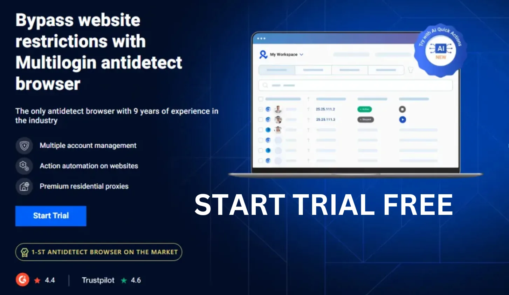

# Multilogin’s Fingerprint Tech: Stay Invisible Like a Pro

The core of any antidetect browser is its fingerprint technology, and **Multilogin** has perfected it. While tools like GoLogin and Incogniton struggle to keep your profiles hidden, Multilogin’s fingerprint tech ensures you stay completely invisible, no matter how many accounts you’re running.

## What Makes Multilogin’s Fingerprinting So Good?
- **Total Anonymity**: Each profile gets a unique fingerprint – different OS, browser, screen resolution, you name it. Platforms like Amazon can’t tell you’re using multiple accounts.
- **Deep Customization**: You can tweak every detail of your fingerprint, something Kameleo can’t match.
- **Proven Results**: Multilogin’s tech has been battle-tested by pros running thousands of accounts without a single ban.

## Why Competitors Can’t Keep Up
GoLogin’s fingerprints often overlap, making it easy for platforms to spot you. AdsPower isn’t much better, with basic fingerprinting that fails against advanced detection systems. Multilogin, on the other hand, is the gold standard for staying under the radar.

## Stay Invisible with Multilogin
Don’t risk your accounts with subpar tools. Get Multilogin now at [this guide](https://adblogin.com/multilogin/) and use code **ADBNEW50** for a 50% discount – plus, check out deals up to 80% off! Stay invisible and keep winning with Multilogin.