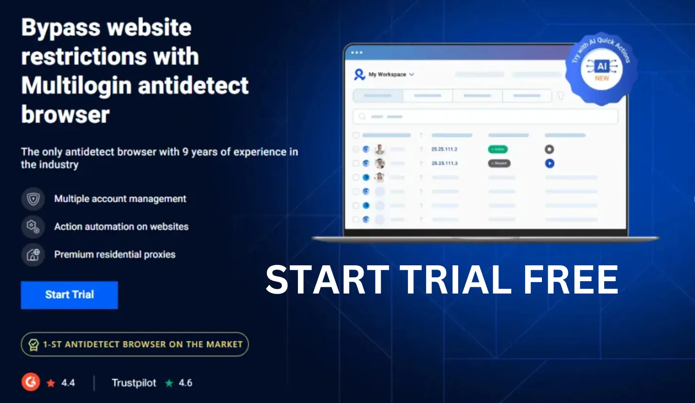

# Is Multilogin Worth the Price? Absolutely!

**Multilogin** isn’t cheap, but it’s worth every penny. While GoLogin, Kameleo, and AdsPower compete on price, Multilogin focuses on value – delivering the power, reliability, and features you need to succeed in the MMO game.

## Why Multilogin is Worth It
- **Top-Notch Quality**: Multilogin’s fingerprint tech and performance are unmatched, unlike Incogniton’s basic features.
- **Long-Term Savings**: A reliable tool like Multilogin saves you from costly bans and crashes, which you’d get with GoLogin.
- **Pro Support**: Multilogin’s support team is fast and helpful, unlike AdsPower’s slow responses.

## Why Pay More?
Paying for Multilogin is an investment in your success. Cheap tools might save you a few bucks upfront, but they’ll cost you thousands in lost campaigns. Multilogin ensures you win, every time.

## Get Multilogin at a Discount
See why Multilogin is worth it. Get it now at [this guide](https://adblogin.com/multilogin/) and use code **ADBNEW50** for a 50% discount – plus, check out deals up to 80% off! Multilogin is worth every penny.